<p align="center">
  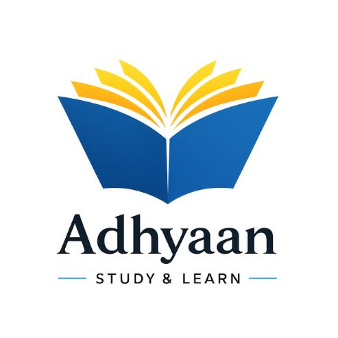
</p>

<p align="center">
  <strong>Adhyaan – Study and Learn</strong><br>
  A Digital and e-Learning Platform 
</p>

<p align="center">
  Live at: <a href="https://adhyaan.vercel.app">https://adhyaan.vercel.app</a>
</p>

---

## About

Adhyaan is a digital library and e-learning platform built specifically for Students and Readers. It gives students and readers a single place to access both academic books organized by board, course, year, semester, and subject — and indie books organized by genre and author. Authors can publish and manage their own content.

---

## Screenshots

### Landing Page
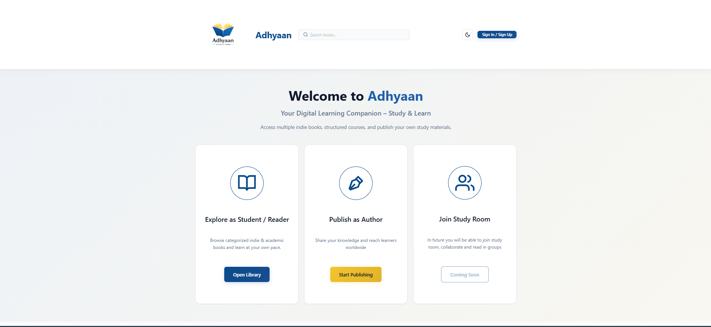

### Home Page
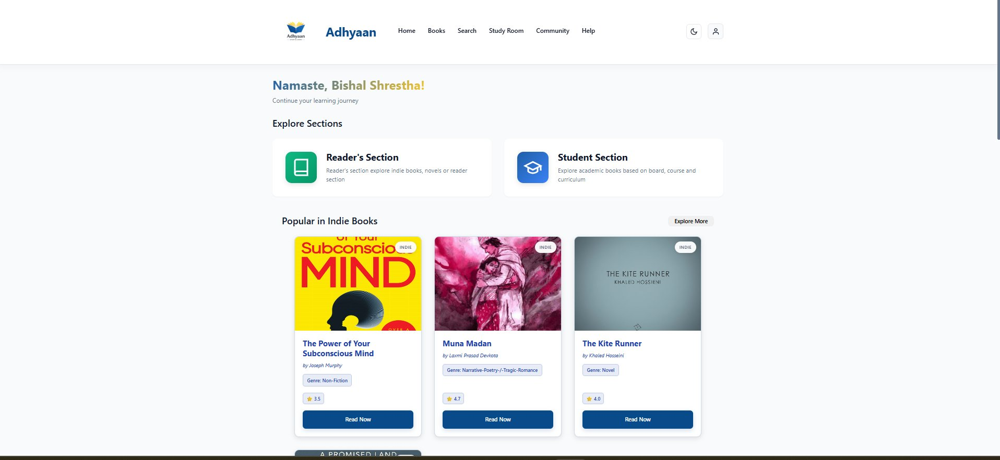

### Author Dashboard
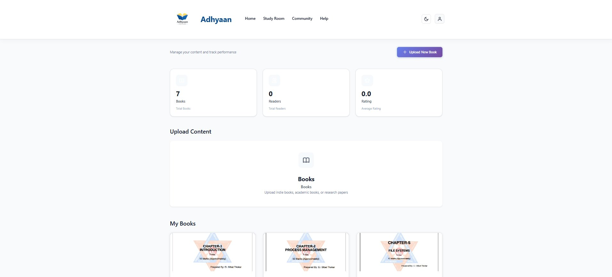

### Student Section 
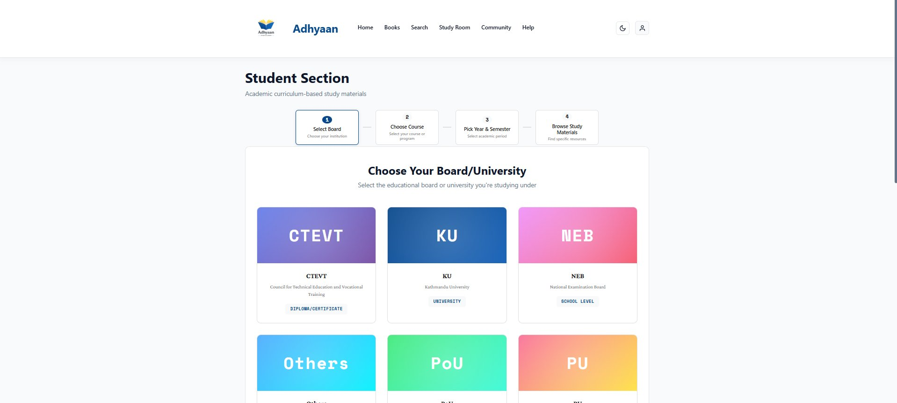

### Reader's Section
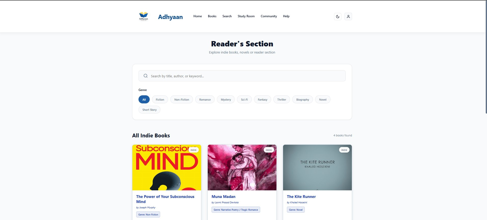

### All Books
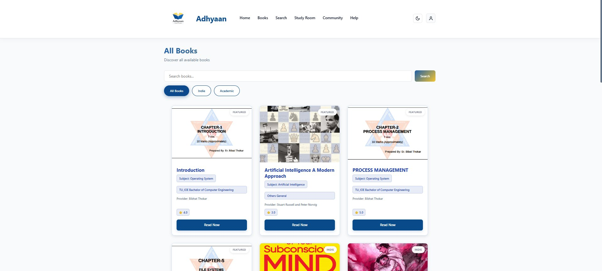

### Search
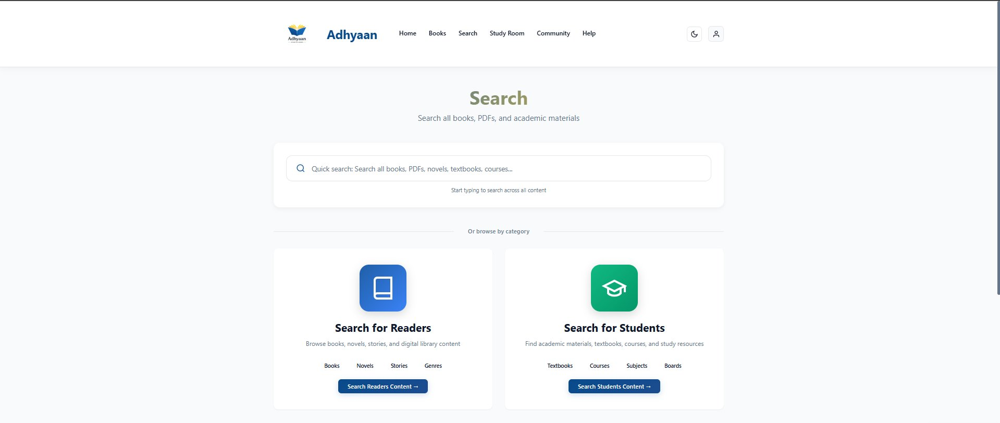

### Reader Search Section
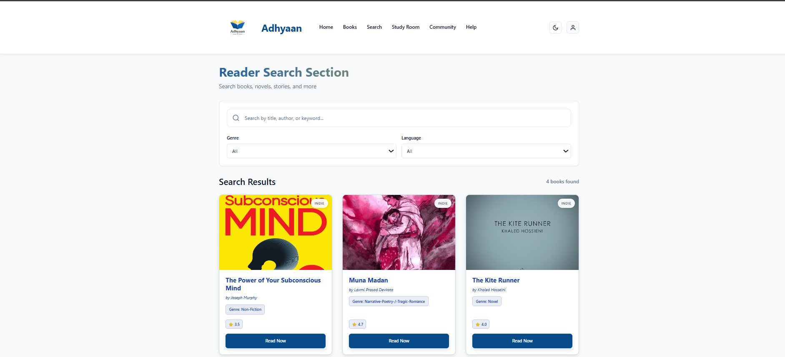

### Student Search Section
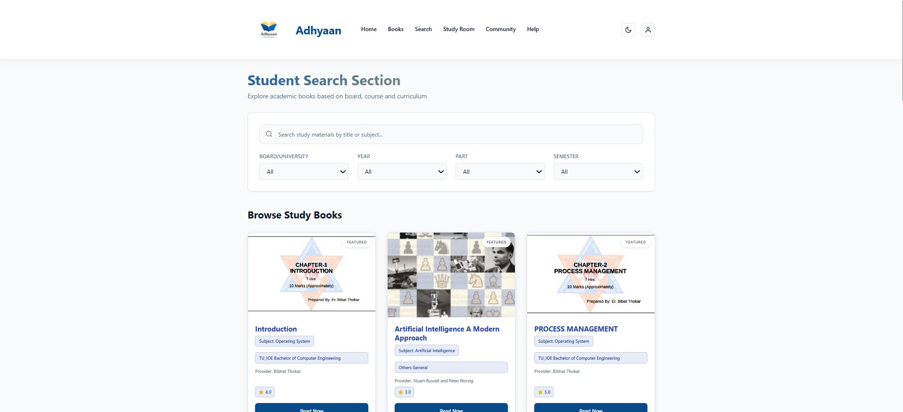
---

## Key Features

### For Students and Readers
- Browse academic books by board, course, year, semester, and subject
- Browse indie books by genre and author
- Read books directly in the browser with a built-in PDF viewer
- Search across all content by title, subject, or author

### For Authors
- Upload academic or indie books in PDF or DOCX format with cover image
- Dashboard view with total books, readers, ratings, and reviews

---

## Tech Stack

| Layer | Technology | Hosted On |
|---|---|---|
| Frontend |    |  |
| Backend |   |  |
| Database |  |  |
| File Storage |  |  |
| Email |  |  |

## Project Structure

```
bishalabps52-adhyaan/
├── backend/
│   ├── app/
│   │   ├── api/v1/          # Route handlers (auth, books, author, admin)
│   │   ├── core/            # Config, database, security
│   │   ├── db/repositories/ # Database repositories
│   │   ├── schemas/         # Pydantic models
│   │   ├── services/        # Auth and Services logic (auth, email)
│   │   └── utils/           # File upload, Vercel Blob
│   └── scripts/             # DB migrations and seed data
└── frontend/
    └── src/
        ├── app/
        │   ├── (public)/    # Landing page
        │   ├── (student)/   # Home, books, search, student section
        │   ├── (author)/    # Author dashboard
        │   ├── admin/       # Admin panel
        │   └── auth/        # Login, register, reset password
        ├── components/      # BookCard, PDFViewer, Navbar, etc.
        ├── hooks/           # useAuth, useRole, useTheme
        └── services/        # API service layer
```

---

## User Roles

**Student / Reader** – The default role. Browse and read all books on the platform, track progress, and leave ratings.

**Author** – Upload and manage books, view engagement statistics, and reach readers across Nepal.

Users can switch between student and author modes from their profile without needing a separate account if author mode is approved.

---

## Coming Soon

- Study Rooms – collaborative reading and discussion spaces for groups
- Author activation via document verification
- Community features

---

### Database Tables ER Diagram (There may be Error) 
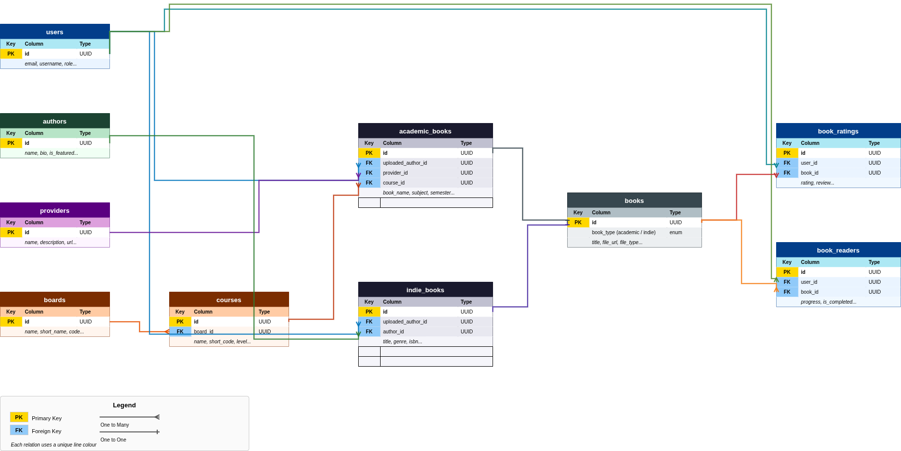

---
