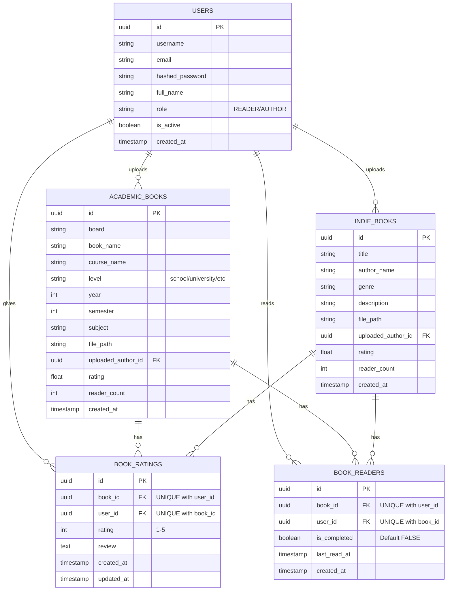

# Adhyaan Database Schema (ER Diagram)

This Mermaid diagram shows the relations between tables in the Adhyaan database.

### Data Integrity Features

1. **Idempotent Reading Tracking**: When a user opens a book, a record is created in `BOOK_READERS`. If it already exists, only `last_read_at` is updated. `is_completed` remains untouched until explicitly toggled.
2. **Single Rating Policy**: Each user can only provide ONE rating per book. Subsequent ratings from the same user will update their existing record in `BOOK_RATINGS` rather than creating duplicates.
3. **Persistent Read Status**: Once `is_completed` is set to `TRUE`, it stays `TRUE` across all future sessions for that specific user and book.

### Paste this into draw.io (Mermaid format):

In draw.io, go to **Arrange > Insert > Advanced > Mermaid...** and paste the code above.
